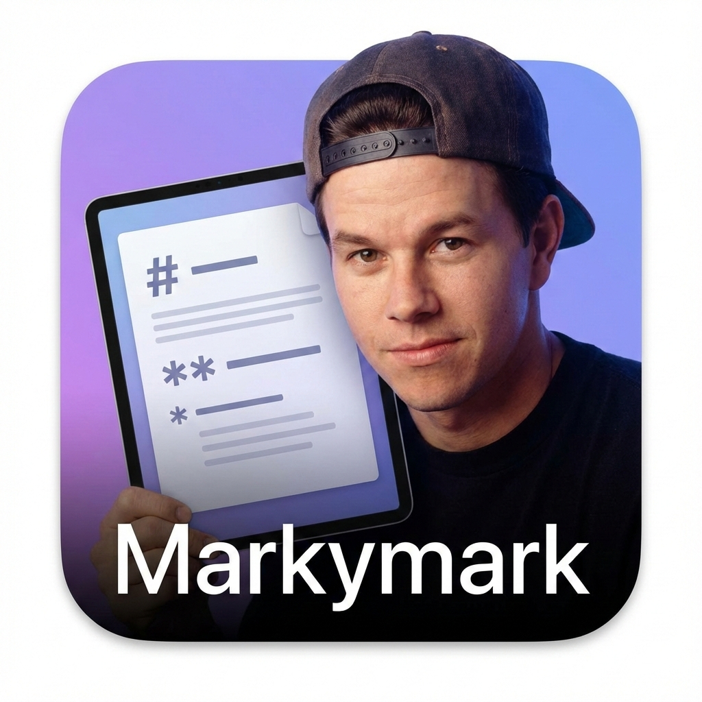

# markymark 

<p align="center">
  
</p>

> *Say hi to your docs* 👋
> **Your personal documentation DJ - one server, always spinning**

## Finally, a Dedicated Markdown Viewer That Works Everywhere

**Double-click a `.md` file in Finder? Opens in markymark.**
**Cmd-click a path in iTerm? Opens in markymark.**
**Run `open README.md` in terminal? Opens in markymark.**

No more markdown files opening in Xcode, VS Code, or raw text editors. markymark gives you a beautiful, dedicated markdown viewer with navigation that integrates seamlessly with macOS - just like Preview for PDFs or QuickTime for videos.

**markymark** is a lightweight local markdown documentation browser that stays running in the background. Call it once from any directory, and it's always ready. Switch directories on the fly without starting new servers. Perfect for Claude Code workflows where you're constantly documenting and exploring context engineering prompts.

## Quick Start (2 Steps)

```bash
# Step 1: Install the gem
gem install markymark

# Step 2: Run the setup wizard
markymark init
```

That's it! The wizard will:
- Install **Markymark.app** to ~/Applications
- Set markymark as the **default app for .md files**
- Configure your preferred server mode

Now double-click any `.md` file or cmd-click paths in iTerm - they'll open beautifully rendered in markymark.

### Scripted Install

For automated setups, accept all defaults:

```bash
gem install markymark && markymark init -y
```

## Features

- 🍎 **Native macOS integration** - Double-click `.md` files, cmd-click in iTerm, `open` command support
- 🔄 **Smart directory switching** - Run `markymark` from any directory to switch existing server
- 📁 **Auto-discovery** - Recursively finds all your markdown and org files
- 📂 **Accordion file organization** - Files grouped by directory with expand/collapse controls
- 🔖 **Bookmarks** - Save frequently-used directories for quick access
- 🌐 **Directory browser** - Navigate to any folder via the UI with quick shortcuts
- 🎨 **GitHub-Flavored Markdown** - Tables, task lists, syntax highlighting
- 🦄 **Org-mode support** - Full org-mode rendering with Emacs-style linking and navigation
- 📊 **Mermaid diagrams** - Flowcharts, sequence diagrams render beautifully
- 🌙 **Dark/Light theme toggle** - One-click switching, persisted in localStorage
- 📋 **Copy file path** - One-click copy of full file path to clipboard (great for sharing with AI agents)
- ✏️ **Edit in external editor** - Open current file in your preferred editor
- 🎬 **Org-reveal presentations** - One-click export and launch for org-reveal slide decks
- 🔗 **Bookmarkable URLs** - Share links to specific docs
- 🖼️ **Image support** - Images in `assets/` folders render properly
- 🌐 **Pumadev integration** - Optional `.test` domain support

## Org-mode Support

markymark renders `.org` files with features that bring Emacs power to your browser:

- **Headings** with TODO states, tags, and collapsible properties drawers
- **Section folding** - Click ▼ or double-click headings (Shift+Tab for all)
- **Floating TOC** - Auto-generated table of contents with scroll tracking
- **Emacs-style linking** - `[[*Heading]]`, `[[#id]]`, `[[file:doc.org::*Heading]]`
- **Search links** - `[[file:doc.org::search term]]` highlights first match
- **Tag navigation** - Click tags to jump to the Tag Index
- **Progress indicators** - Checkbox lists show completion percentage
- **Syntax highlighting** - Code blocks with Rouge highlighting
- **Org-reveal presentations** - Files with `#+REVEAL_` headers show a 🎬 button to export and launch presentations

### Org-reveal Integration

For `.org` files that use org-reveal (have `#+REVEAL_ROOT:`, `#+REVEAL_THEME:`, etc.), a presentation button appears in the toolbar. Requirements:
- Emacs with server running (`M-x server-start`)
- `ox-reveal` package installed

Click the 🎬 button to export via `emacsclient` and open the presentation in your browser.

See [docs/SUPPORTED_FEATURES.org](docs/SUPPORTED_FEATURES.org) for complete feature reference and [docs/ORG_MODE_GUIDE.org](docs/ORG_MODE_GUIDE.org) for examples.

## Usage

### Opening Files Directly

```bash
# Open a specific markdown file (the killer feature!)
markymark README.md
markymark ~/docs/ARCHITECTURE.md

# Browse current directory
markymark

# Browse specific directory
markymark ~/my-docs
```

When you open a file directly, markymark:
1. Sets the root to the file's directory
2. Opens the browser with that file displayed
3. Shows all other markdown files in the sidebar

### Server Management

```bash
# Check server status
markymark --status

# Stop running server
markymark --stop

# Custom port
markymark --port 8080

# Don't open browser automatically
markymark --no-browser
```

### Setup Commands

```bash
# Interactive setup wizard
markymark init

# Individual setup commands
markymark --install-app     # Install Markymark.app
markymark --uninstall-app   # Remove Markymark.app
markymark --set-default     # Set as default .md handler
```

## One Server, All Your Docs

**markymark runs as a single background process.** Once started, it stays running and responds to all your commands:

```bash
# Start once from anywhere
cd ~/docs/project-a
markymark

# Switch to different docs instantly - same server!
cd ~/work/api-docs
markymark  # Server switches to api-docs, no restart

# Open a specific file from anywhere
markymark ~/notes/TODO.md  # Switches to ~/notes, opens TODO.md
```

**One server. Any directory. Always ready.**

## Browse & Bookmarks

markymark includes a built-in directory browser accessible via the sidebar:

- **Quick shortcuts**: Jump to Home, Downloads, Desktop, or Work directories
- **Bookmarks**: Save frequently-accessed directories for one-click access
- **Full navigation**: Browse to any directory on your system

Bookmarks are stored in `~/.markymark/bookmarks.json` and persist across sessions.

## Editor Configuration

The **Edit** button (✏️) in the toolbar opens the current file in an external editor. The editor is determined in this order:

1. `MARKYMARK_EDITOR_<EXT>` - Filetype-specific (e.g., `MARKYMARK_EDITOR_ORG` for `.org` files)
2. `MARKYMARK_EDITOR` - General markymark override
3. `VISUAL` - Standard Unix visual editor
4. `EDITOR` - Standard Unix editor
5. Platform default (`open` on macOS, `xdg-open` on Linux)

```bash
# Example: Use VS Code for markdown, Emacs for org files
export MARKYMARK_EDITOR_MD="code"
export MARKYMARK_EDITOR_ORG="emacs"

# Or set a single editor for all files
export MARKYMARK_EDITOR="code"
```

## Why markymark?

If you work with AI coding assistants like Claude Code, you're probably generating documentation constantly. Design docs, implementation plans, debugging notes, context engineering prompts - all in markdown, all needing quick reference.

### Claude Code Workflow

```bash
# Claude creates ARCHITECTURE.md, IMPLEMENTATION_PLAN.md, etc.
# Double-click any of them → beautifully rendered in markymark

# Exploring Claude's built-in skills?
markymark ~/.claude/commands

# Check out your AI framework prompts
markymark ~/bmad-agent
```

### Context Engineering Made Visual

Modern AI frameworks use markdown for prompts and skills:
- **Claude Code**: Skills and commands in `~/.claude/`
- **BMAD**: Agent method prompts and templates
- **AgentOS / OpenSpec**: Specification documents
- **Custom frameworks**: Your own prompt libraries

markymark renders these beautifully with:
- Formatted tables and lists
- Mermaid diagrams for workflows
- Syntax-highlighted code blocks
- Accordion navigation for nested directories

## Pumadev Integration

For those who prefer `.test` domains over remembering ports:

```bash
# Set up pumadev integration
markymark --setup-pumadev

# Now always available at http://markymark.test
```

See `markymark --pumadev-info` for detailed setup instructions.

## Requirements

- **Ruby >= 2.7**

### Installing Ruby

markymark requires Ruby 2.7 or higher. macOS includes Ruby 2.6, which is too old. Install a modern Ruby via:

```bash
# Homebrew
brew install ruby

# Or use a version manager (rbenv, rvm, asdf)
rbenv install 3.3.0
```

## Platform Support

**markymark's core markdown viewer works on any platform with Ruby** - macOS, Linux, Windows.

```bash
# Works everywhere
markymark ~/docs
markymark README.md
```

### macOS Native Integration

The native app integration (double-click `.md` files, cmd-click in iTerm, `open` command) is **macOS only** and requires:
- **Xcode Command Line Tools** (for Swift compilation during `markymark init`)

```bash
# Install Xcode Command Line Tools if you don't have them
xcode-select --install

# Then run the setup wizard
markymark init
```

### Contributing Cross-Platform Native Integration

We'd love native file associations on other platforms! Contributions welcome for:

- **Linux**: `.desktop` file integration, xdg-open support
- **Windows**: Registry associations, shell integration

## Development

```bash
git clone https://github.com/fkchang/markymark.git
cd markymark
bundle install

# Run locally
bundle exec exe/markymark /path/to/docs
```

## Contributing

Bug reports and pull requests are welcome on GitHub at https://github.com/fkchang/markymark.

## License

The gem is available as open source under the terms of the [MIT License](https://opensource.org/licenses/MIT).

---

<p align="center">
  ♪ ♫ ♪<br>
  ♫  ♪<br>
  ♫ ♪ ♫<br>
  <br>
  <i>Built with good vibrations</i> 🎵
</p>
